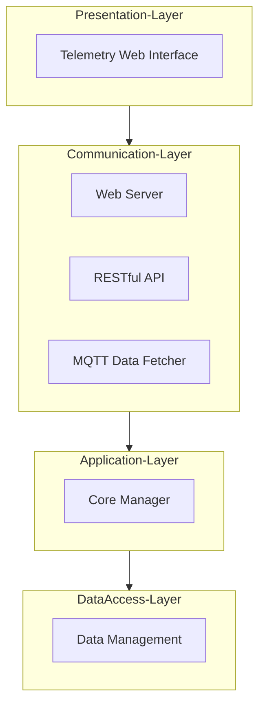
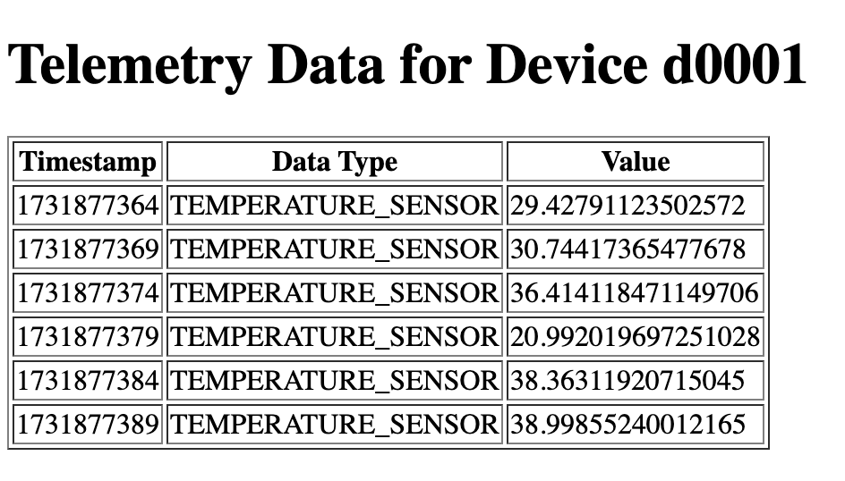
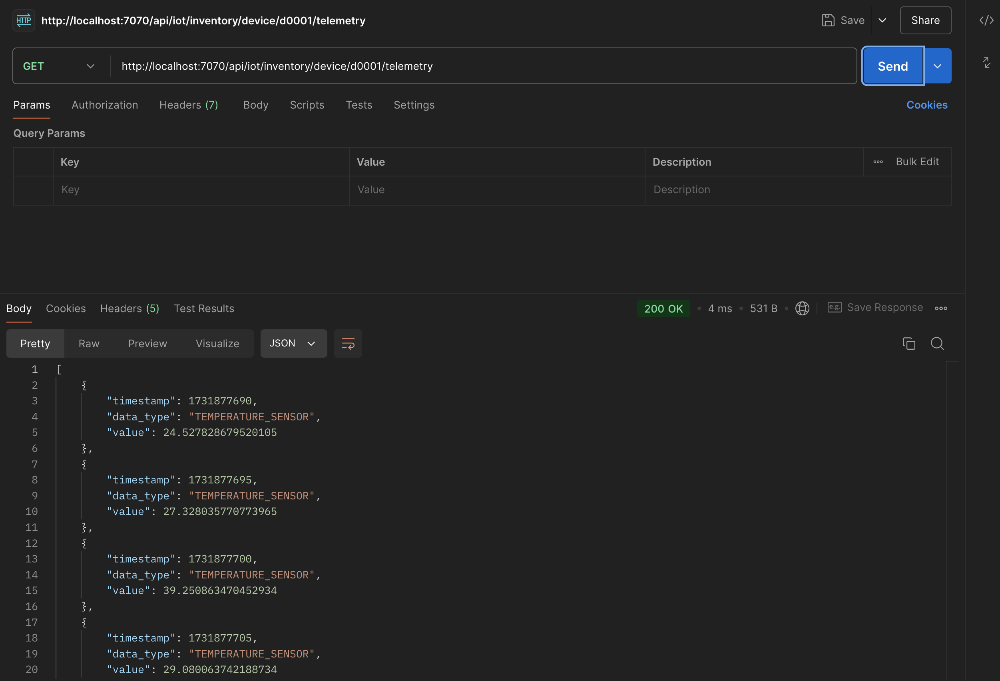

# IoT Monolithic Software Architecture - Laboratory

This project is designed as an IoT Monolithic Software Architecture Laboratory with the step by step
implementation of a simple IoT application using a monolithic architecture. 
The application is structured into different modules, 
each responsible for specific functionalities, ensuring modularity, scalability, and maintainability.

The architecture is divided into 4 distinct layers, 
each responsible for specific functionalities, ensuring modularity, 
scalability, and maintainability.

This Laboratory is a "simplified" version of the Playground available at [https://github.com/Distributed-IoT-Software-Arch-Course/iot-monolithic-arch-playground](https://github.com/Distributed-IoT-Software-Arch-Course/iot-monolithic-arch-playground)
where in this case we handle only telemetry data instead of a more complex IoT architecture.

## n-Tier Architecture Overview

Designing an n-Tier Software Architecture for an Internet of Things (IoT) 
application involves separating concerns into different layers, each responsible for specific aspects of the system. 
Below is a proposed architecture that meets the specified requirements for the target Playground and Example:

The idea of the architecture (using the framework [https://mermaid.js.org/](https://mermaid.js.org/)) is the following: 



## System Architecture Description

The system architecture is structured into five distinct layers, each responsible for specific functionalities, 
ensuring a modular and scalable design for the Internet of Things (IoT) application. The layers are as follows:

### 1. Presentation Layer
- **Web Interface**: This component provides the user interface for the system, allowing users to interact with the application through a web browser. It displays device information, telemetry data, and other relevant details.

### 2. Communication Layer
- **Web Server**: Handles HTTP requests from the Web Interface and other clients. It serves static and dynamic content and manages incoming and outgoing web traffic.
- **RESTful API**: Exposes system functionalities and data through RESTful endpoints, allowing external applications to interact with the system programmatically.
- **MQTT Data Fetcher**: Manages MQTT communication, subscribing to MQTT topics to collect device information and telemetry data from various devices.

### 3. Application Layer
- **Core Services**: Implements the business logic of the application. It processes data received from the Communication Layer, executes core application functionalities, and manages the flow of information between different layers.

### 4. Data Access Layer
- **Data Management**: Provides an abstraction layer for data access. It handles CRUD operations (Create, Read, Update, Delete) and ensures data integrity and consistency when interacting with the underlying storage systems.

## Implementation

The implementation starts with the creation of the different layers of the architecture proceeding in the following reverse order
with the idea of each layer to be independent and to interact with the previous layer and enable the next layer:

- Data Access Layer
- Application Layer
- Communication Layer
- Presentation Layer

### Data Access Layer

The Data Access Layer is responsible for managing the data of the application and in this scenario is implemented as an in-memory data storage
storing the telemetry data for each device structured as a Dictionary where the key is the device ID and the value is a list of telemetry data.

Create a new folder `data` and add the following files named `data_manager.py` with the following content:

```python
class DataManager:
    """
    DataManager class is responsible for managing the data of the application.
    Abstracts the data storage and retrieval operations.
    In this implementation everything is stored in memory.
    """

    # The data structure to store the telemetry data
    device_timeseries_data = {}

    def add_device_telemetry_data(self, device_id, telemetry_data):
        """Add a new telemetry data for a given device"""
        if device_id not in self.device_timeseries_data:
            self.device_timeseries_data[device_id] = []
        self.device_timeseries_data[device_id].append(telemetry_data)
```

### Application Layer

In this simplified implementation version the core module wrap the data access layer and provide the core functionalities of the application.
The idea is to decouple the data access layer from the application layer and provide a more modular and scalable design.
This additional layer allows for easier testing and maintenance of the application and the introduction of new functionalities 
without affecting the data access layer.

Since the application layer will use data received from the communication layer, we need to define the data transfer objects (DTOs)
in a separate folder to ensure a clean separation of concerns. 
For this reason we create the `communication` folder and then the `dto` folder and add the following files named `telemetry_message.py` 
with the following content:

```python
import json

class TelemetryMessage:
    """
    Telemetry Message DTO class
    mapping the telemetry message data structure with:
    - timestamp: timestamp of the telemetry message
    - data_type: type of the telemetry message
    - value: value of the telemetry message
    """
    def __init__(self, timestamp, data_type, value):
        self.timestamp = timestamp
        self.data_type = data_type
        self.value = value

    def to_json(self):
        return json.dumps(self, default=lambda o: o.__dict__)
```

Create a new folder `application` and add the following files named `core_manager.py` with the following content:

```python
from communication.dto.telemetry_message import TelemetryMessage
from data.data_manager import DataManager


class CoreManager:
    """
    Core Manager class that handles the core functionality of the application
    Main methods re-call the data manager methods to decouple the core functionality from the data management
    Additional dedicated methods are used to handle telemetry data from devices with a specific application logic
    """

    def __init__(self, data_manager: DataManager):
        """Initialize the CoreManager with a Data Manager"""
        self.data_manager = data_manager

    def handle_mqtt_device_telemetry_data(self, device_id: str, device_telemetry_data: TelemetryMessage):
        """ Handle telemetry data from device """

        # Check request not None and instance of TelemetryMessage
        if device_telemetry_data is None or not isinstance(device_telemetry_data, TelemetryMessage):
            raise ValueError("Invalid TelemetryMessage")
        else:
            self.data_manager.add_device_telemetry_data(device_id, device_telemetry_data)
            print(f'Telemetry data received from device {device_id}')

    def get_telemetry_data_by_device_id(self, device_id: str):
        """
        Get telemetry data by device id from data manager
        :param device_id: Device id associated with telemetry data
        :return: List of telemetry data
        """
        return self.data_manager.get_telemetry_data_by_device_id(device_id)
```

### Communication Layer

The Communication Layer is responsible for handling incoming requests from clients, exposing system functionalities through RESTful API endpoints, 
fetching data from IoT devices using MQTT, and serving the web interface to users.

#### MQTT Data Fetcher

In the folder `communication` add a new folder `mqtt` add the following files named `mqtt_data_fetcher.py`.
The MQTT Data Fetcher Class in charge of fetching data from the MQTT Broker
The fetcher is executed in a separate thread in order to avoid blocking the main thread.
Uses a configuration file to read the MQTT Broker configuration and username/password information.

The first part of the class is the following:

```python
from application.core_manager import CoreManager
from communication.dto.telemetry_message import TelemetryMessage
import json
import paho.mqtt.client as mqtt
import yaml
import os
import threading

class MqttDataFetcher:
    """ MQTT Data Fetcher Class in charge of fetching data from the MQTT Broker
    The fetcher is executed in a separate thread in order to avoid blocking the main thread.
    Uses a configuration file to read the MQTT Broker configuration and username/password information."""

    def __init__(self, config_file: str, core_manager: CoreManager):

        # Fetcher Thread
        self.fetcher_thread = None

        # MQTT Client Initialization to None
        self.client = None

        # Configuration File Path
        self.config_file = config_file

        # Data Manager
        self.core_manager = core_manager

        # Default Configuration Dictionary
        self.configuration_dict = {
            "broker_ip": "127.0.0.1",
            "broker_port": 1883,
            "target_telemetry_topic": "device/+/temperature",
            "username": None,
            "password": None
        }

        # Read Configuration from target Configuration File Path
        self.read_configuration_file()

        # MQTT Broker Configuration
        self.mqtt_broker_host = self.configuration_dict["broker_ip"]
        self.mqtt_broker_port = self.configuration_dict["broker_port"]
        self.mqtt_topic = self.configuration_dict["target_telemetry_topic"]
        self.mqtt_username = self.configuration_dict["username"]
        self.mqtt_password = self.configuration_dict["password"]

        # Initialize MQTT Client
        self.init_mqtt_client()
```

Then we need to add the following method to handle the MQTT configuration file (in Yaml):

```python
def read_configuration_file(self):
    """ Read Configuration File for the REST API Server
     :return:
    """

    # Get the main communication directory
    main_app_path = os.path.dirname(os.path.dirname(os.path.dirname(os.path.abspath(__file__))))

    # Construct the file path
    file_path = os.path.join(main_app_path, self.config_file)

    with open(file_path, 'r') as file:
        self.configuration_dict = yaml.safe_load(file)

    print("Read Configuration from file ({}): {}".format(self.config_file, self.configuration_dict))
```

The next method is associated to the initialization of the MQTT Client:

```python
def init_mqtt_client(self):
    """ Initialize the MQTT Client
    :return:
    """

    # Create MQTT client
    self.client = mqtt.Client()
    self.client.on_connect = self.on_connect
    self.client.on_message = self.on_message
```

Then we have the definition of the callback methods for the MQTT Client with the following methods:

```python
def on_connect(self, client, userdata, flags, rc):
    """ The callback for when the client receives a CONNACK response from the server."""
    print("Connected to MQTT Broker with result code " + str(rc))
    self.client.subscribe(self.mqtt_topic)
    print(f"Subscribed to topic: {self.mqtt_topic}")

def on_message(self, client, userdata, msg):
    """ The callback for when a PUBLISH message is received from the server."""

    if mqtt.topic_matches_sub(self.mqtt_topic, msg.topic):
        try:

            # Decode the payload
            payload = msg.payload.decode()

            # Get JSON data from the message payload
            json_data = json.loads(payload)

            # Extract the device ID from the topic
            device_id = msg.topic.split('/')[1]

            # Deserialize the payload into a TelemetryMessge object
            telemetry_message = TelemetryMessage(**json_data)

            # Update the data manager with the new data
            print(f"Received message from device {device_id}: {payload}")

            # Handle the telemetry message
            self.core_manager.handle_mqtt_device_telemetry_data(device_id, telemetry_message)

        except Exception as e:
            print(f"Error processing MQTT message: {str(e)}")
```

Last but not least we have the method to start the MQTT Data Fetcher on a separate thread and trigger the 
connection to the MQTT Broker and the loop to keep the connection alive and start receiving messages:

```python
def connect(self):
    """ Connect to the MQTT Broker and start the loop """

    # Check if username and password are provided
    if self.mqtt_username and self.mqtt_password:
        print("Setting username and password ...")
        self.client.username_pw_set(self.mqtt_username, self.mqtt_password)

    # Connect to MQTT Broker
    print("Connecting to MQTT Broker ...")
    self.client.connect(self.mqtt_broker_host, self.mqtt_broker_port, 60)

    # Start the MQTT loop
    print("Starting MQTT Loop ...")
    self.client.loop_forever()

def start(self):
    self.fetcher_thread = threading.Thread(target=self.connect)
    self.fetcher_thread.start()
```

The MQTT Data Fetcher uses a configuration file to read the MQTT Broker configuration and username/password information.
Create a `config` folder and add a new file named `mqtt_fetcher_conf.yaml` with the following content:

```yaml
broker_ip: "127.0.0.1"
broker_port: 1883
username: null
password: null
target_telemetry_topic: "device/+/temperature"
```

#### HTTP API Server

The HTTP API Server (based on FluskRESTful) is responsible for exposing RESTful API endpoints to interact with the system programmatically.
In this simple implementation, we will create a single endpoint to read telemetry data from an IoT device.

Create a folder `api` folder in the `communication` folder and then an additional subfolder `resources`.
In the `resources` folder add a new file named `telemetry_data_resource.py` representing the RESTful Telemetry Data
Resource with the following content:

```python
from flask_restful import Resource, reqparse
from application.core_manager import CoreManager

class TelemetryDataResource(Resource):
    """Resource to handle the Telemetry Data of a specific Device"""

    def __init__(self, **kwargs):
        # Inject the CoreManager instance
        self.core_manager: CoreManager = kwargs['core_manager']

    def get(self, device_id):
        """GET Request to retrieve the Telemetry Data of a target device"""

        device_telemetry_data = self.core_manager.get_telemetry_data_by_device_id(device_id)

        if device_telemetry_data is not None:
            result_location_list = []

            # Iterate over the telemetry data to build a serializable telemetry data list
            # transforming the telemetry data into a dictionary. Then it will be Flask to serialize it into JSON
            for telemetry_data in device_telemetry_data:
                result_location_list.append(telemetry_data.__dict__)

            return result_location_list, 200  # return data and 200 OK code
        else:
            return {'error': "Device Not Found !"}, 404
```

Then we can create the HTTP API Server in the `communication/api` folder creating a new file `rest_api_server.py`.
This file will contain a class handling the RESTful API endpoints for the system and allowing
its execution (as already done for the MQTT Data Fetcher) in a separate thread.

The first part of the class is the following:

```python
from flask import Flask, request
from flask_restful import Api
from application.core_manager import CoreManager
from communication.api.resources.telemetry_data_resource import TelemetryDataResource
import threading
import yaml
import os

class RestApiServer:
    """
    RESTful API Server designed to manage the Inventory of IoT Devices
    """

    # Default Endpoint Prefix
    DEFAULT_ENDPOINT_PREFIX = "/api/iot/inventory"

    def __init__(self, config_file: str, core_manager: CoreManager):

        # Initialize REST API Server and Flask Application to None
        # They will be initialized in the init_rest_api method
        self.api = None
        self.app = None

        # Server Thread
        self.server_thread = None

        # Configuration File Path
        self.config_file = config_file

        # Data Manager
        self.core_manager = core_manager

        # Set a default configuration
        self.configuration_dict = {
            "rest":{
                "api_prefix": self.DEFAULT_ENDPOINT_PREFIX,
                "host": "0.0.0.0",
                "port": 7070
            }
        }

        # Read Configuration from target Configuration File Path
        self.read_configuration_file()

        # Initialize REST API
        self.init_rest_api()
```

Then we need to add the following method to handle the REST API configuration file (in Yaml):

```python
def read_configuration_file(self):
    """ Read Configuration File for the REST API Server
     :return:
    """

    # Get the main communication directory
    main_app_path = os.path.dirname(os.path.dirname(os.path.dirname(os.path.abspath(__file__))))

    # Construct the file path
    file_path = os.path.join(main_app_path, self.config_file)

    with open(file_path, 'r') as file:
        self.configuration_dict = yaml.safe_load(file)

    print("Read Configuration from file ({}): {}".format(self.config_file, self.configuration_dict))
```

The next method is associated to the initialization of the REST API Server:

```python
def init_rest_api(self):
    """ Initialize REST API with resources and endpoints
    :return:
    """

    # Create a new Flask Application and the REST API from Flask Restful
    self.app = Flask(__name__)
    self.api = Api(self.app)

    # Add Resources and Endpoints
    self.api.add_resource(TelemetryDataResource, self.configuration_dict['rest']['api_prefix'] + '/device/<string:device_id>/telemetry',
                          resource_class_kwargs={'core_manager': self.core_manager},
                          endpoint="device_telemetry_data",
                          methods=['GET'])
```

The last methods are associated to the start of the REST API Server on a separate thread and the trigger of the Flask Application:

```python
def run_server(self):
    """ Start the REST API Server """
    self.app.run(host=self.configuration_dict['rest']['host'], port=self.configuration_dict['rest']['port'])

def start(self):
    self.server_thread = threading.Thread(target=self.run_server)
    self.server_thread.start()

def stop(self):
    """ Stop the REST API Server (Flask Method)
    In this code, request.environ.get('werkzeug.server.shutdown')
    retrieves the shutdown function from the environment.
    If the function is not found, it raises a RuntimeError,
    indicating that the server is not running with Werkzeug.
    If the function is found, it is called to shut down the server."""

    # Shutdown the server
    func = request.environ.get('werkzeug.server.shutdown')
    if func is None:
        raise RuntimeError('Not running with the Werkzeug Server')

    # Call the shutdown function
    func()

    # Wait for the server thread to join
    self.server_thread.join()
```

As already done for the MQTT Data Fetcher, the REST API Server uses a configuration file to read the REST API configuration.
Add a new file named `api_conf.yaml` in the `config` folder with the following content:

```yaml
rest:
  api_prefix: "/api/iot/inventory"
  host: "0.0.0.0"
  port: 7070
```

### Web Server

The Web Server is responsible for serving the web interface to users, handling incoming HTTP requests, and rendering the web pages.
We use Flask to create a simple web server that serves static and dynamic content to users through the file
associated to the Presentation Layer.

Create a new folder `web` in the `communication` folder and add a new file named `web_server.py` with the following initial content:

```python
class WebServer:
    """Web Server Class for the Flask Web Server handling Web Pages assocaited
    to the Presentation Layer of the Architecture"""

    def __init__(self, config_file:str, core_manager: CoreManager):

        # Server Thread
        self.server_thread = None

        # Save the data manager
        self.core_manager = core_manager

        # Save the configuration file
        self.config_file = config_file

        # Get the main communication directory
        main_app_path = os.path.dirname(os.path.dirname(os.path.dirname(os.path.abspath(__file__))))

        # Construct the file path
        template_dir = os.path.join(main_app_path, 'presentation')

        # Set a default configuration
        self.configuration_dict = {
            "web": {
                "host": "0.0.0.0",
                "port": 7071
            }
        }

        # Read Configuration from target Configuration File Path
        self.read_configuration_file()

        # Create the Flask app
        self.app = Flask(__name__, template_folder=template_dir)

        # Add URL rules to the Flask app mapping the URL to the function
        self.app.add_url_rule('/device/<string:device_id>/telemetry', 'telemetry', self.telemetry)
```

Then we need to add the following method to handle the Web Server configuration file (in Yaml):

```python
def read_configuration_file(self):
    """ Read Configuration File for the Web Server
     :return:
    """

    # Get the main communication directory
    main_app_path = os.path.dirname(os.path.dirname(os.path.dirname(os.path.abspath(__file__))))

    # Construct the file path
    file_path = os.path.join(main_app_path, self.config_file)

    with open(file_path, 'r') as file:
        self.configuration_dict = yaml.safe_load(file)
    
    print("Read Configuration from file ({}): {}".format(self.config_file, self.configuration_dict))
```

The next step is to add a method to render the telemetry web template after retrieving the telemetry data from the core manager:

```python
def telemetry(self, device_id):
    """ Get telemetry data for a specific device and render the telemetry.html template"""
    telemetry_data = self.core_manager.get_telemetry_data_by_device_id(device_id)
    return render_template('telemetry.html', telemetry_data=telemetry_data, device_id=device_id)
```

The last methods are associated to the start of the Web Server on a separate thread and the trigger of the Flask Application:

```python
def run_server(self):
    """ Run the Flask Web Server"""
    self.app.run(host=self.configuration_dict['web']['host'], port=self.configuration_dict['web']['port'])

def start(self):
    self.server_thread = threading.Thread(target=self.run_server)
    self.server_thread.start()

def stop(self):
    """ Stop the REST API Server (Flask Method)
    In this code, request.environ.get('werkzeug.server.shutdown')
    retrieves the shutdown function from the environment.
    If the function is not found, it raises a RuntimeError,
    indicating that the server is not running with Werkzeug.
    If the function is found, it is called to shut down the server."""

    # Shutdown the server
    func = request.environ.get('werkzeug.server.shutdown')
    if func is None:
        raise RuntimeError('Not running with the Werkzeug Server')

    # Call the shutdown function
    func()

    # Wait for the server thread to join
    self.server_thread.join()
```

As already done for the MQTT Data Fetcher and the REST API Server, the Web Server uses a configuration file to read the Web Server configuration.
Add a new file named `web_conf.yaml` in the `config` folder with the following content:

```yaml
web:
  host: "0.0.0.0"
  port: 7071
```

## Presentation Layer

In this example, the Presentation Layer is represented by a simple web interface that using Flask web templates
renders the data received from the Application Layer (for additional info you can visit: [https://flask.palletsprojects.com/en/stable/tutorial/templates/](https://flask.palletsprojects.com/en/stable/tutorial/templates/)). The web interface is focused only on the visualization of 
the telemetry data of a target device identified through the device ID and specified in the URL.
Flask templates uses the Jinja2 template engine to render dynamic content in the web pages.
Some example are available at the following link: [https://jinja.palletsprojects.com/en/3.0.x/templates/](https://jinja.palletsprojects.com/en/3.0.x/templates/).

Create a new folder `presentation` in the main directory and add the file `telemetry.html` with the following content:

```html
<!DOCTYPE html>
<html lang="en">
<head>
    <meta charset="UTF-8">
    <title>Telemetry Data for Device {{ device_id }}</title>
</head>
<body>
    <h1>Telemetry Data for Device {{ device_id }}</h1>
    
    <table border="1">
        <tr>
            <th>Timestamp</th>
            <th>Data Type</th>
            <th>Value</th>
        </tr>
        
        <tr>
            <td>{{ telemetry.timestamp }}</td>
            <td>{{ telemetry.data_type }}</td>
            <td>{{ telemetry.value }}</td>
        </tr>
        
    </table>
    
    <p>No telemetry data available for this device.</p>
    
</body>
</html>
```

## Main Application

The main application orchestrates the interactions between different layers of the system, 
initializing the components, and starting the threads for the Communication Layer components.

Create a new file named `main.py` in the main directory with the following content:

```python
from communication.api.rest_api_server import RestApiServer
from communication.web.web_server import WebServer
from communication.mqtt.mqtt_data_fetcher import MqttDataFetcher
from application.core_manager import CoreManager
from data.data_manager import DataManager

API_CONFIG_FILE = "config/api_conf.yaml"
WEB_CONFIG_FILE = "config/web_conf.yaml"
MQTT_CONFIG_FILE = "config/mqtt_fetcher_conf.yaml"

if __name__ == '__main__':

    # Data Manager initialization
    data_manager = DataManager()

    # Create the Core Manager with the Data Manager reference
    core_manager = CoreManager(data_manager)

    # Create RESTful API Server
    rest_api_server = RestApiServer(API_CONFIG_FILE, core_manager)

    # Run RESTful API Server
    rest_api_server.start()

    # Create Web Server
    web_server = WebServer(WEB_CONFIG_FILE, core_manager)

    # Run Web Server
    web_server.start()

    # Create MQTT Data Fetcher
    mqtt_data_fetcher = MqttDataFetcher(MQTT_CONFIG_FILE, core_manager)

    # Run MQTT Data Fetcher
    mqtt_data_fetcher.start()
```

## Testing

To simulate the data fetching from IoT devices, you can publish messages to the MQTT broker as an already registered device
`d0001` using the script `test/mqtt/json_producer_default_device.py`.

In order to test the application you can run the `main.py` file that run the application activating 
each layer of the architecture and run in parallel the different modules as independent threads.

After receiving the telemetry data, you can access the web interface to view the telemetry data for the device `d0001`

Once the application is running you can access the web interface by opening a web browser and navigating to the following URLs:

- [http://localhost:7071/device/d0001/telemetry](http://localhost:7071/device/d0001/telemetry): Shows telemetry data for a selected device

If you want to create telemetry data for additional devices or locations you can have a look at the following test scripts:

- `test/mqtt/json_producer_device_1.py`: Publishes telemetry data for a new test device with a different Id
- `test/mqtt/json_producer_device_2.py`: Publishes telemetry data for a new test device with a different Id

Example of the Web Interface and Presentation Layer are the following:



It is also possible to retrieve the telemetry data for a specific device using the RESTful API endpoint.
Send a GET Request to the following URL using a REST client (e.g., PostMan) or a web browser:

- HTTP Method: GET
- Payload: None
- URL: [http://localhost:7070/api/iot/inventory/device/d0001/telemetry](http://localhost:7070/api/iot/inventory/device/d0001/telemetry)

An example of the response is the following:

```json
[
    {
        "timestamp": 1731877690,
        "data_type": "TEMPERATURE_SENSOR",
        "value": 24.527828679520105
    },
    {
        "timestamp": 1731877695,
        "data_type": "TEMPERATURE_SENSOR",
        "value": 27.328035770773965
    },
    {
        "timestamp": 1731877700,
        "data_type": "TEMPERATURE_SENSOR",
        "value": 39.250863470452934
    },
    {
        "timestamp": 1731877705,
        "data_type": "TEMPERATURE_SENSOR",
        "value": 29.080063742188734
    }
]
```

Through PostMan the result is the following:

